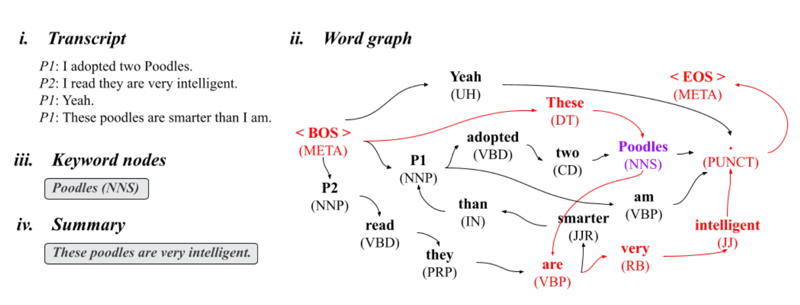

# Dialogue Summarization

Code for [**_Unsupervised Abstractive Dialogue Summarization with Word Graphs and POV Conversion_**](https://aclanthology.org/2022.wit-1.1/), presented at [WIT Workshop @ ACL2022](https://megagon.ai/2nd-workshop-on-deriving-insights-from-user-generated-text-wit/).

<p align="center">
    
</p>

# Installation
```bash
pip install [-e] .
```

# Running benchmarks

## Meeting benchmarks

Extracted **AMI** and **ISCI** datasets were taken from [this repository](https://github.com/xcfcode/meeting_summarization_dataset).

Pre-segmented **AMI** and **ISCI** datasets were taken from [this repository](https://bitbucket.org/dascim/acl2018_abssumm/src/master/).

```bash
scripts/run_meetings.sh
```

## Other baselines

Download DialogSum, SAMSum, MediaSum, Summscreen, and ADSC (too big for GitHub!). Modify the data paths in scripts below accordingly.

```bash
scripts/run_baselines.sh
```
